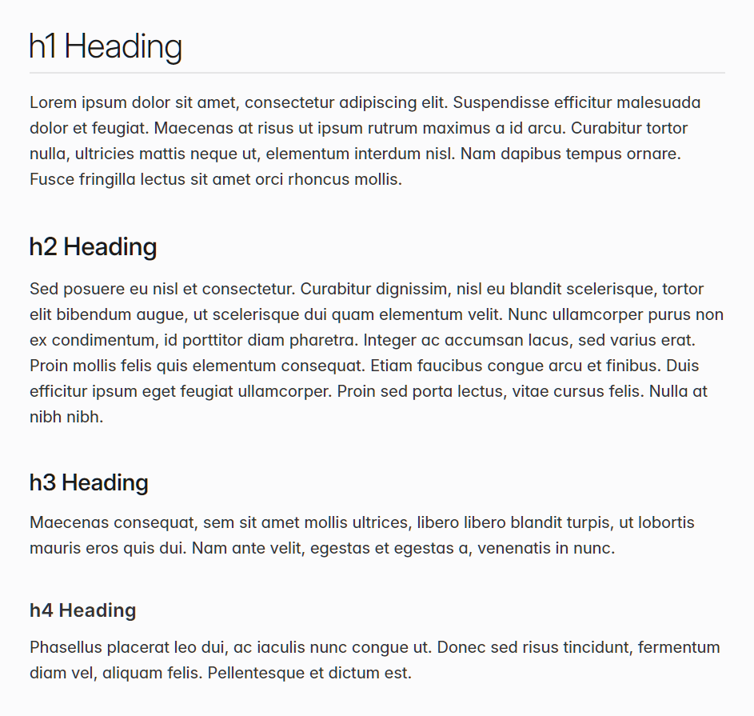
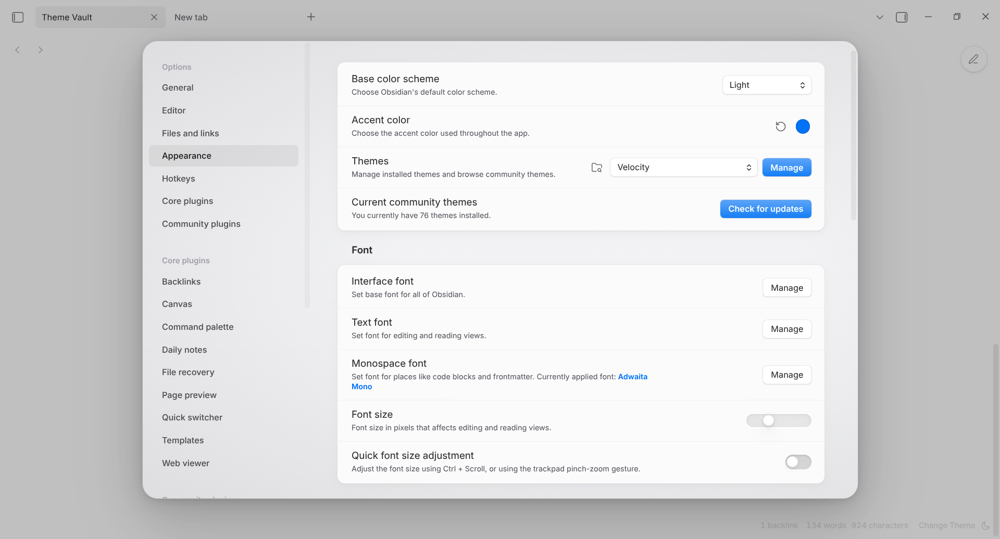
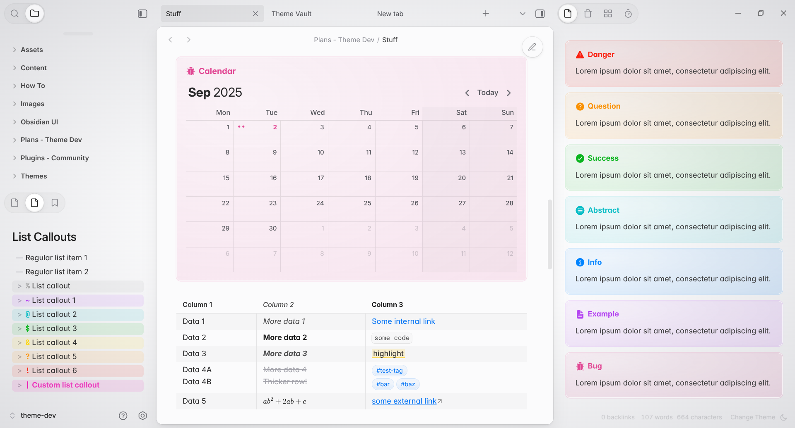
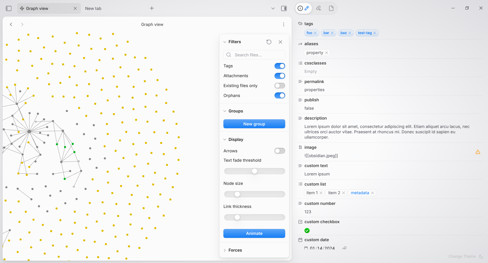
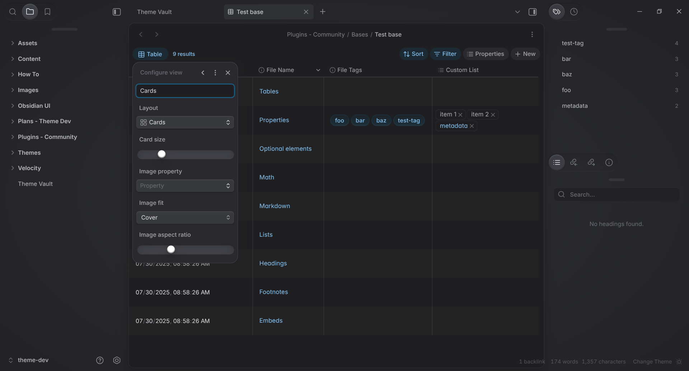
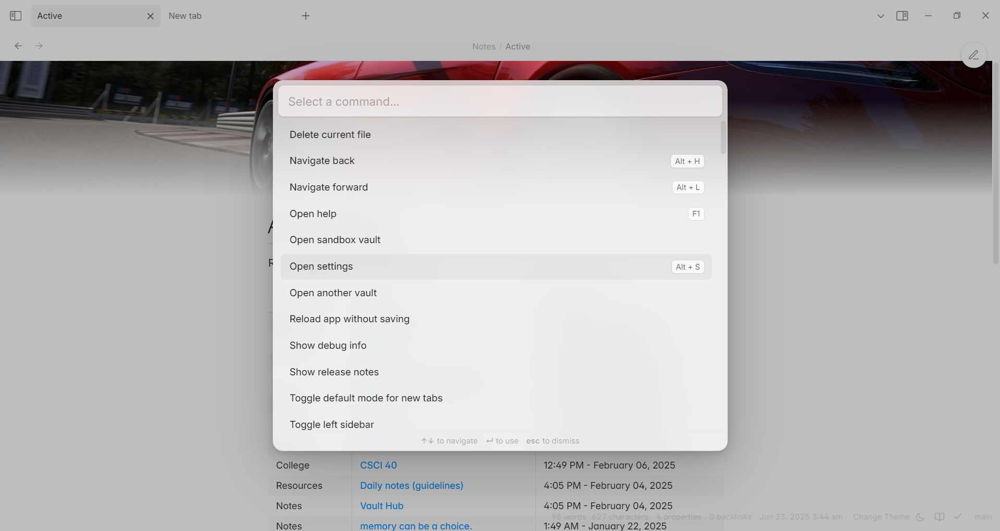

## Future-Proof

Velocity is a timeless, **modernist** theme for Obsidian. Bold and _opinionated_, the theme is subtle on the surface, but dares to reimagine what the Obsidian user interface experience can be.    

Velocity draws heavy inspiration from **Apple's design principles and contemporary web aesthetics**. It evokes a clean, yet playfully mechanical, almost tactile kind of modernity. In addition, the theme aims to evoke - even if only subconsciously - the sleek user interfaces of various mid-to-late-2000s **racing games**. 

Velocity has now reached the first stage of ``beta`` development, after **nearly a whole year** of painstaking craftsmanship and work. While it is still technically incomplete and missing certain features (such as mobile support), its quality and attention to detail is already among the best themes in Obsidian's history. 

## Table of Contents

- [Installation](#Installation)
- [Images](#Images)
- [FAQ](#FAQ)
- [Features](#Features)
- [Roadmap](#Roadmap)
- [Background](#Background)
- [Credits](#Credits)

## Installation [^](#Table-of-Contents)
Velocity is not officially released on the Obsidian store. Currently, the easiest method to install the theme is by using the **BRAT** plugin in Obsidian. Simply paste the link of the main branch of the repository in the BRAT plugin's settings. BRAT automatically handles changes made upstream by checking for any new changes in the repo upon launching Obsidian, ensuring that you always have the most up-to-date version of Velocity.

Alternatively, you can opt to download the files manually. You will need the ``theme.css`` and ``manifest.json`` files. Create a folder named "Velocity" inside the Obsidian themes folder, located at ``your-vault/.obsidian/themes``, and place the files inside. The theme should show up in the Appearance tab the next time you open the vault.

## Images [^](#Table-of-Contents) 

## FAQ [^](#Table-of-Contents)
- **Do I have to buy Velocity?**
  - No. The theme is free, as it should be.
- **What kind of user is this theme designed for?**
  - Velocity is designed for creatives, thinkers and note-takers of all kinds, those who love good looking apps with smooth interactions, and users who want their vault to look premium and polished. It will please users looking for a balanced degree of customization features, without overwhelming with too many options to tweak. Fans of Swiss Design, early 2010s Apple graphics design, and 2000s racing games will feel right at home.
	  - Velocity is not designed for absolute minimalists. 
	  - It is not designed for absolute maximalists, either. 
	  - It is probably not ideal for power users seeking terminal UI aesthetics, nor is it suitable for those who want something fuzzy and warm. 
	  - It is not designed for people who wish to have absolute, total control over customization. 
	  - Lastly, it is not a theme for those afraid to try something **bold, innovative and new.**
- **How can I customize the theme?**
  - Download the **Style Settings** plugin from within the Obsidian app's plugin store. The plugin is free as are most plugins, and the settings for Velocity should appear automatically so long as you have the theme enabled.
- **Where can I find the documentation?**
  - Docs are WIP and not a priority at the moment. 
- **How long have you been working on this?**
  - Around 10 months, as of ``1.3.0-beta``'s release.
- **Why should I choose Velocity? What makes it different from other themes?**
  - If there is ONE reason to at least _try_ Velocity, it is because nearly no other theme is crafted with as much attention to detail in the user interface department. Countless hours have been spent making sure interactions, spacing, color balance and texture feel _just right_. In simple terms, Velocity is designed to make you feel as if you were using a premium, paid app - to make you forget even for a moment that you're in Obsidian.
  - It is one of the leading themes to implement styling tweaks to the new and highly acclaimed **Bases** core plugin. The level of modification and improvements to the UI of Bases is unrivalled by any existing theme.
  - Markdown has received much love, too. Velocity offers typographic alignment tweaks and features that might please some typography enthusiasts. 
  - It is the _only_ theme which accounts for heading indent misalignment with larger headings. It is also perhaps best-in-class when it comes to callout manipulation - you can put just about anything inside of them, such as headings, code, Dataview queries and more, and it _will look good_. 
  - And if all of this fails to convince you, maybe just the novelty of a theme designed over the course of nearly a whole year, with an inspiration as idiosyncratic as _racing game user interfaces_, might convince you.
  - Every single word in this README was written **without the use of language models (AI)**. The same goes for the theme itself.
- **Will you add feature X/Y/Z to Velocity?**
  - It depends. Certain features you may be looking for might already be present in the theme. Others which are missing may be added or rejected based on whether the feature is aligned with Velocity's overall philosophy, or whether the feature is better off as some snippet due to complexity/feature creep. In any case, please make requests for features in the **Issues** page or in the Obsidian **Discord** thread for Velocity.
- **Will this theme work with plugin X/Y/Z?**
  - As an opinionated UI-centric theme, Velocity **may interfere with the styling of some plugins' settings** or modals in a way that is not intended or aesthetic. This is a necessary and inevitable tradeoff when designing a theme which alters the default UI to such an extent. Nevertheless, in my own testing, most plugins work just fine with Velocity. The worst you'll experience in most cases is some minor menu jank, but the actual functionality of plugins should be **totally unaffected.**
- **Why does it look so much like theme X/Y/Z?**
  - Velocity has been created with multiple inspirations in mind, including various themes I used for my own vaults before deciding to make my own. The most obvious parallels are to **[Cupertino](https://github.com/aaaaalexis/obsidian-cupertino)**, which is a result of that theme's innovations and approaches inspiring the current generation of themes. However, Velocity differs from Cupertino in many ways once you look past the surface level. At their core, the two themes are fundamentally different in approach and philosophy.
  - The keen-eyed user or fellow theme developer may notice some paralles with the beautifully tactile **[Primary](https://github.com/primary-theme/obsidian)** by Cecilia May. This is because I have taken much inspiration from her exacting attention to detail and focus on tactile responsiveness in UI interactions. 
  - I have detailed the full list of works I have drawn inspiration or borrowed code from in the Credits section of the README. **Any other resemblances are thus purely coincidental.** In any case, I do not intend to merely copy or imitate the work of a fellow theme dev. The whole project has been an outlet for me to _say something_ about design and about Obsidian theming, and so it has been very personal and intentional from the outset. 
- **Why does the theme look different from before?**
  - If you have been around since the earlier alphas (up until the ``0.6.x`` versions) then you may notice the theme is no longer retro or skeuomorphic. This is because I quickly realized that the theme would never appeal to a larger audience and my specific design ideas and obsessions would forever remain obscure and niche. 
  - While the ``1.0.0`` revamp to a more modern, minimalist style was informed by outside pressures, this does not mean that Velocity has lost its character or 'soul'. I have made sure that key design elements and quirks are carried over from the older versions. Several users have testified that they enjoy the current versions _even more_ than the old ones.

## Features [^](#Table-of-Contents)

### CSSClasses

Velocity comes with a set of **CSSclasses** which can be used to alter the styling of elements on a note-by-note basis:

| Name                  | Function                                                   |
| :-------------------- | :----------------------------------------------------------|
| `override`            | Quick utility to disable any other cssclasses in the note. |
| `hide-metadata`       | Hides any properties visible in the note.                  |
| `hide-title`          | Hides the inline-title for that particular note.           |
| `show-title`          | Shows the inline-title for that particular note.           |
| `style-justify` / `justified` | Justifies paragraph, blockquote and callout text.  |
| `style-margin-top'    | Adds additional padding to the top of the note.            |
| `style-wide`  | Sets maximum note width, equivalent to disabling readable width.   |
| `superheading`        | Turns editor H1 into a large Swiss Design heading.         |
| `supertitle`          | Turns editor H1 into a very large Swiss Design heading.    |
| `simple-title`        | Gives the inline title the standard heading style.         |

### Auto-Hide

Velocity comes with a novel feature first pioneered in Micro Mike: the ability to automatically hide the sidebars whenever the window's width is too narrow. This prevents the main panel from becoming too cramped or unreadable.

**Auto-Hide can be disabled** in the theme's Style Settings.

## Roadmap [^](#Table-of-Contents)

Expect a full release _during, or shortly after Obsidian October._ Due to real-life concerns, I will not be able to work much on the theme for most of September, but I will still be on the look-out for new issues.

### Planned features:

- Three preset **contrast options** (named "driving modes" - **Sport**, **Touring** and **Race**)
- **Alternate color schemes** (five per driving mode as a minimum by release)
- Canvas styling 
- Empty page styling
- **Full mobile support** and special styling
- Implementation of Damian Korcz's **Alternative Checkboxes** reference set

The expected version number for release is ``Velocity 1.5.0``.

## Background [^](#Table-of-Contents)

The story I want to reflect on, about working on this theme and how it has changed me, is still ongoing. Therefore I cannot yet finish this section. Perhaps I will have a lengthy recollection ready by the time of release.

## Credits [^](#Table-of-Contents)

#### Themes:

**Sanctum** - the main theme I used in the past and a major influence on Velocity's typography, as well as its choice of icon modifications.

**Border, Primary & Mado** - major influences and sources of code for earlier versions of Velocity. While barely any Mado or Border code remains in Velocity, I wouldn't have managed to get the theme to this state without learning from their example. Primary in particular informs this theme's approach to never leave any detail untouched.

**Cupertino & Composer** - modern themes which influenced the current iteration of Velocity. 

**Willemstad** - a source of inspiration for the modified community themes page in both old and new versions of Velocity.

**Micro Mike** - its "mini-mode" is the basis for Velocity's Auto-hide feature.

### People:

Under construction
