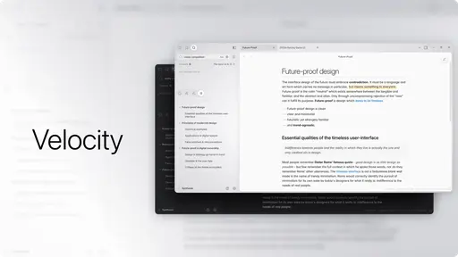
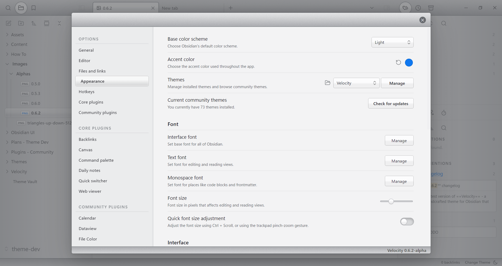
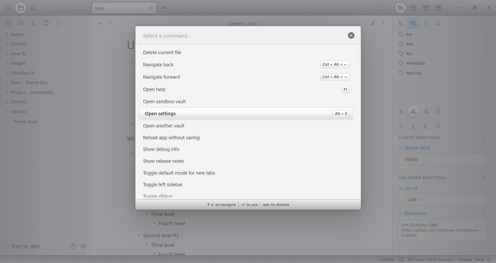
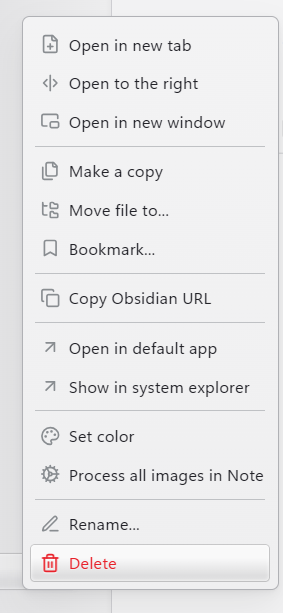
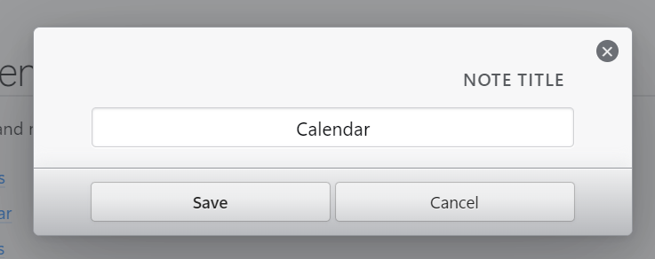
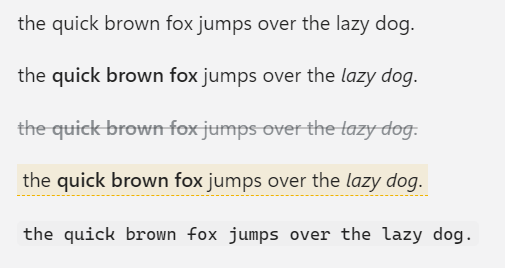
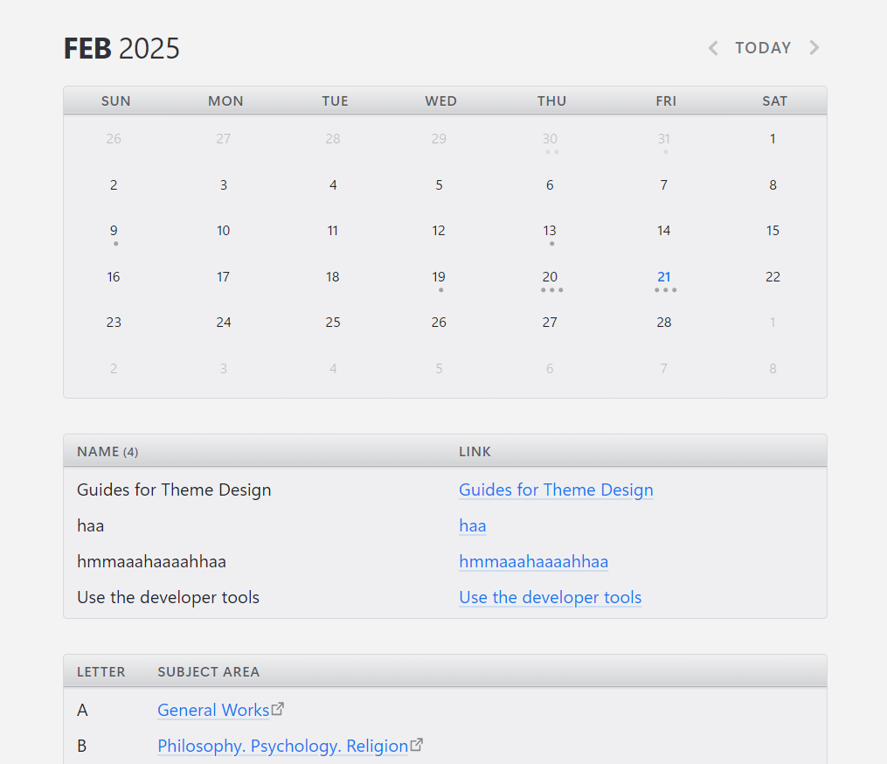

# Velocity
Velocity is a **tactile** theme for Obsidian. 

It draws heavily from the latter period of Apple's **Aqua** design language, as well as the interfaces of various 2000s **racing game** titles (hence the name). 

I intend for Velocity to be a <ins>fusion of the best parts of old and new UI design</ins> - a perfect _midpoint_ between the modern, minimalist flat design and the now-dated skeuomorphism of the late 2000s.

The theme is still in the middle of ``alpha`` development. It is thus highly incomplete, lacking a dark mode or any customization, and even this ``README`` is subject to change. 

But I trust that what's there is enough to _inspire you_. Because I believe that truly good UI is not one that merely stands out of the way - but rather, one which calmly inspires you to do your best work. 

# Images 

#### Interface

#### Editor

# Installation
Since it is not officially released on the Obsidian store, the only way to get Velocity is by setting up the files yourself and downloading directly from this repo, or by using the **BRAT** plugin in Obsidian and pasting the link to this repo in the plugin settings.

# Background

Under construction

# Roadmap

Under construction

# Credits

Under construction
